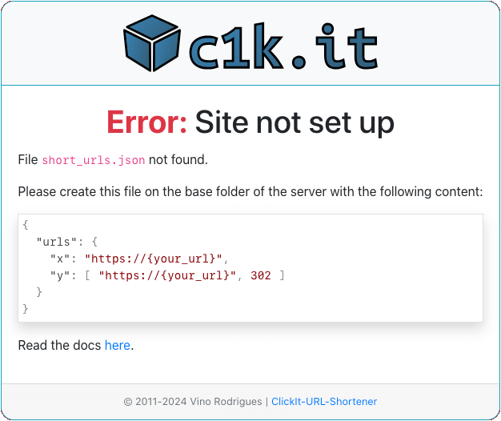

# *<small>Welcome to</small>* ClickIt-URL-Shortener

## Installation

This source contains all the files needed to host source on Github.

However, for running this code on a server of your own then only need 1<sup>*</sup> of the files:

- `index.php`

Ummmm... and a server-side "url rewrite" rules file.  For Apache this will be:

- `.htaccess`

-- for other servers... you'll need to research that on your own.


## Configuration

### Config file

At this stage the redirector will run, but all you'll see is a page showing you that you need a configuration file.

<center></center>

... and as it says, you will also need to create a `short_urls.json` file.

> This repo has an example of this file called `short_urls.sample.json`, that you can copy, or just rename.

In this file you can store your redirections, like so:

```json
{
  "urls": {
    "code": "https://github.com/vinorodrigues/clickit-url-shortener"
  }
}
```

The data in the `urls` array should be in the format of `"{short}": "{long url}"`.

### Config format

You can add as many URL's as you want, except there are a few rules to follow; short names:

1. can contain letters, digits, and underscores.
2. are case sensitive *(`y` and `Y` are different)*.
3. should not use the reserved words, which are the single digit command names used within the redirector, namely: `e`, `h`, `i`, `u`, and `x`.

The short URL's will be used with a default `307` HTTP Response code.  If you'd like to use a different response code you can stipulate that code as a:
1. comma separated string appended to the long URL,
2. a JSON indexed array, with the code in the second position,

Examples of the above are:

```json
{
  "urls": {
    "1": "https://{your_url}, 308",
    "2": [ "https://{your_url}", 301 ]
  }
}
```

You can only use one of the 4 accepted redirection codes, namely:

- **`301`** - **Moved Permanently**

    The URL of the requested resource has been changed permanently. The new URL is given in the response.

- **`302`** - **Found**

    This response code means that the URI of requested resource has been changed temporarily.

    Further changes in the URI might be made in the future. Therefore, this same URI should be used by the client in future requests.

- **`307`** - **Temporary Redirect**

    The server sends this response to direct the client to get the requested resource at another URI with the same method that was used in the prior request.

    This has the same semantics as the 302 response code, with the exception that the user agent must not change the HTTP method used.

- **`308`** - **Permanent Redirect**

    This means that the resource is now permanently located at another URI, specified.

    This has the same semantics as the 301 response code, with the exception that the user agent must not change the HTTP method used.

> If you need to know more about HTTP Response codes, read the [Wiki](https://en.wikipedia.org/wiki/List_of_HTTP_status_codes#3xx_redirection) article on this topic.

### Base redirection

By default, if you open the redirector without a short code it will show you a "Hello" page.  You can override this and implement a default URL redirection, i.e. "if no short is provided then use this one".  To do this, just use **`0`** as your short, like so:

```json
{
  "urls": {
    "0": "https://{your_url}"
  }
}
```


## *

That's it for now.  Have fun!  ;)

> Made with &#x2665; by Vino Rodrigues
